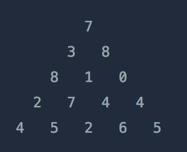

# 정수 삼각형

### 문제 설명

위와 같은 삼각형의 꼭대기에서 바닥까지 이어지는 경로 중,
거쳐간 숫자의 합이 가장 큰 경우를 찾아보려고 합니다. 
아래 칸으로 이동할 때는 대각선 방향으로 한 칸 오른쪽 또는 왼쪽으로만 이동 가능합니다. 
예를 들어 3에서는 그 아래칸의 8 또는 1로만 이동이 가능합니다.

삼각형의 정보가 담긴 배열 triangle이 매개변수로 주어질 때, 
거쳐간 숫자의 최댓값을 return 하도록 solution 함수를 완성하세요.

### 제한사항
- 삼각형의 높이는 1 이상 500 이하입니다.
- 삼각형을 이루고 있는 숫자는 0 이상 9,999 이하의 정수입니다.

### 입출력 예
| triangle | result |
| --- | --- |
| [[7], [3, 8], [8, 1, 0], [2, 7, 4, 4], [4, 5, 2, 6, 5]] | 30 |

### 풀이

최상위 부터 줄기를 타고 내려오면서 숫자의 합을 저장하고 
이때 겹쳐지는 줄기에서 최대값만 추출하여 다시 아래로 내려보냄. 
최대값이 아닌값은 아래로 내려가도 최대값이 될 수 없으므로 삭제한다.

이전 층까지의 합을 저장할 sum_list = []를 비어두고 시작한다. 
이전 층의 합의 결과와 현재 층을 합해 새로운 sum_list 를 생성한다.
예를들어 이전 층이 [7] 이고 현재층이 [3, 8]이면 
먼저 첫번째 원소인 7과 연결된 3,8의 합을 sum_list = [10, 15]에 집어 넣는다.
이때, 합쳐지는 줄기는 없으므로 그대로 return한다.

그 다음층인 [8, 1, 0]과 pre_sum_list = [10, 15]은
첫번째인 10과 연결된 8, 10의 합을 새로운 sum_list = [18, 11]에 추가하고
두번째 원소인 15와 연결된 1, 0의 합을 똑같이 추가한다 sum_list = [18, 11, 16, 15]

이때 원소 15와 1의 결과인 16과 10과 1의 결과인 11이 한 줄기에서 합쳐진다.
그래서 합쳐진 줄기는 최대값만을 내려보내므로 sum_list = [18, [11, 16], 15] => [18, 16, 15]을 return 한다.

(4번째층) pre_sum_list = [18, 16, 15] 와 [2, 7, 4, 4]에서
18 -> [2, 7] => [20, 25]  
16 -> [7, 4] => [23, 20]  
15 -> [4, 4] => [19, 19]  
sum_list = [20, [25, 23], [20, 19], 19] => [20, 25, 20, 19] 

(5번째층) pre_sum_list = [20, 25, 20, 19] 와 [4, 5, 2, 6, 5]  
20 -> [4, 5]  => [24, 25]  
25 -> [5, 2]  => [30, 27]  
20 -> [2, 6]  => [22, 26]  
19 -> [6, 5]  => [25, 24]  
sum_list = [24, [25, 30], [27, 22], [26, 25], 24] => [24, 30, 27, 26, 24] 이므로

최대값은 sum_list에서 최대값인 30이 된다.

